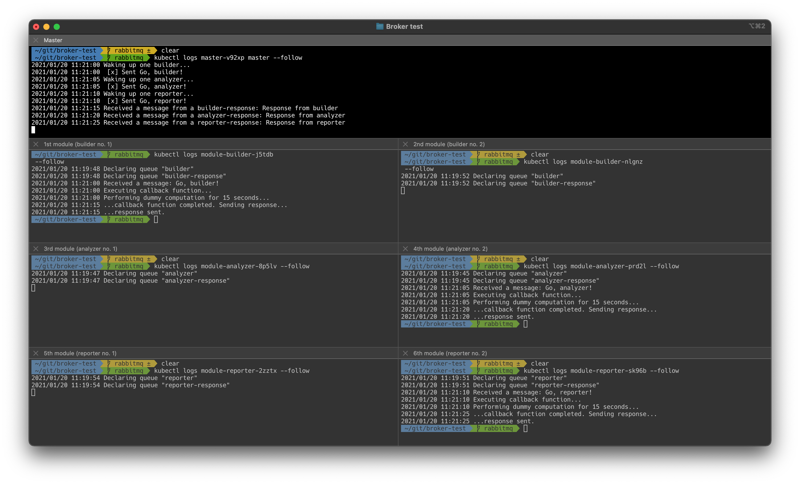

# RabbitMQ Work Queue example

Based on [these tutorials](https://www.rabbitmq.com/tutorials/tutorial-two-go.html),
this repo contains a MWE of a master that sends messages to various modules:
a [builder](modules/builder),
an [analyzer](modules/analyzer),
and a [reporter](modules/reporter).

Those modules then send a response back to the master.

<p align="center">
    
</p>

Modules use the
Quartermaster
[`synclib`](https://github.com/QMSTR/synclib) library
to interact with RabbitMQ.

## Demo setup

- A [RabbitMQ instance](https://kubernetes.io/docs/tasks/job/coarse-parallel-processing-work-queue/#starting-a-message-queue-service)
- One [master Job](master/master.yaml) issuing messages in all queues
- Three dummy [module ReplicaSets](modules) containing Pods waiting for different kind of messages 

## Configuration

Set the RabbitMQ address for the [master](master/rabbitmq_address.env)
and for [all modules](modules/base/rabbitmq_address.env).

## Run the demo

1. First, build and push all the images:
    ```bash
    make images
    ```
1. Start RabbitMQ:
    ```bash
    kubectl apply -k rabbitmq
    ```
1. Wait for RabbitMQ to start:
    ```bash
    kubectl logs $(kubectl get pod --selector component=rabbitmq -o=name) --follow
    ```
1. Start any subset of dummy modules:
    ```bash
    kubectl apply -k modules/builder
    kubectl apply -k modules/analyzer
    kubectl apply -k modules/reporter
    ```
   or, to start them all:
    ```bash
    kubectl apply -k modules
    ```
1. Start the master:
    ```bash
    kubectl apply -k master
    ```

Exactly one Pod of each [module ReplicaSet](modules) will consume its corresponding message.\
All the modules will then reply after having performed some dummy computation.

## RabbitMQ dashboard

1. Port-forward RabbitMQ's management port:
    ```bash
    kubectl port-forward svc/rabbitmq-service 15672:15672
    ```
1. Visit [localhost:15672](http://localhost:15672) and use the following credentials to log in:
    - Username: `guest`
    - Password: `guest`
